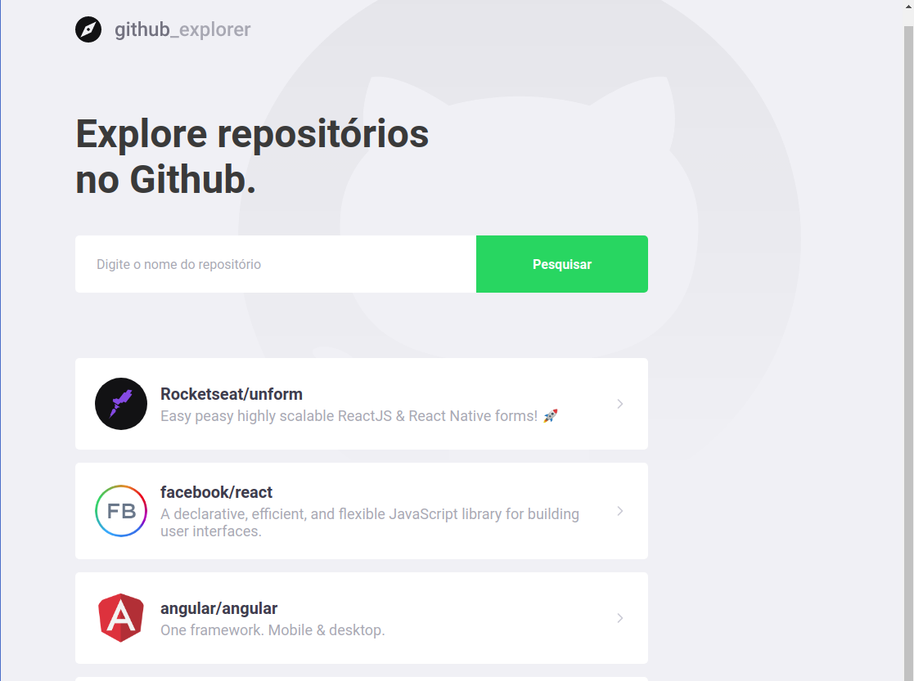
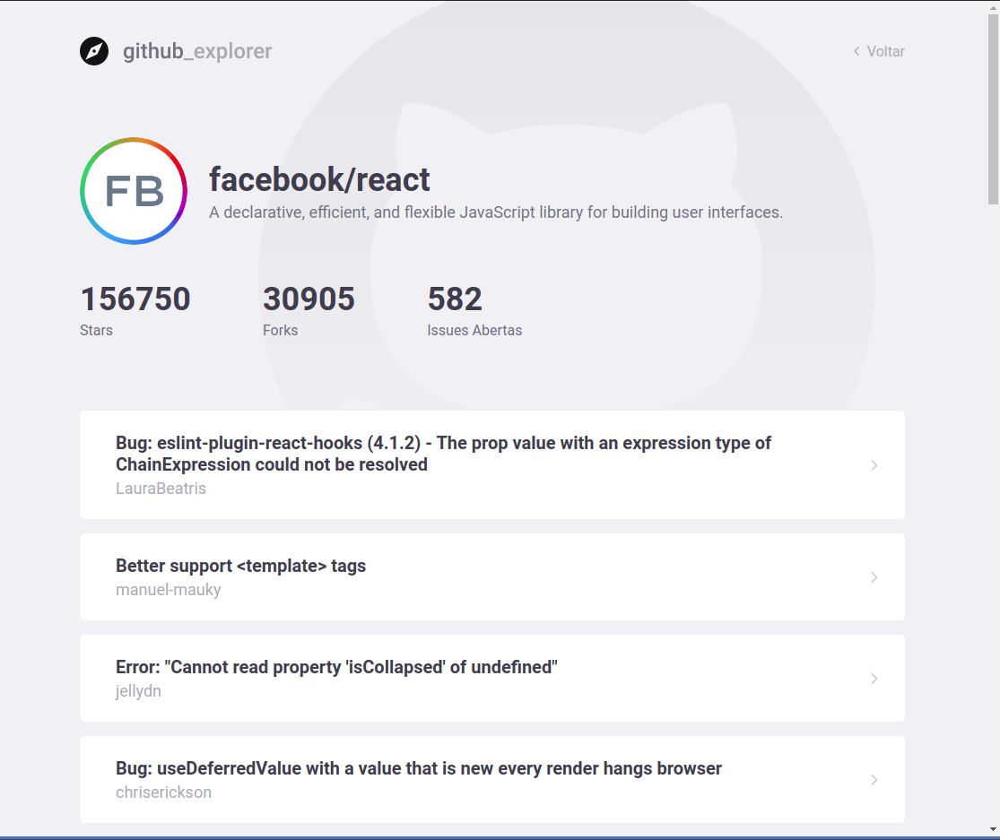

# github-explorer
Um projeto simples em React feito com intuito de adquirir novos conhecimentos. Usamos a API do GitHub para trazer informações de repositórios do github para nossa tela.
Vou colocar em práticas os aprendizados que tive nesse projeto no próximo desafio do GoStack. 🚀

